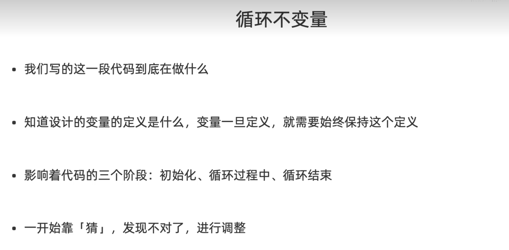

> 参考: https://vip1.cyou/aSz
> 
# 循环不变量
- **在循环的过程中保持不变的性质**
- 这里的`量`,表示`断言`:可以判断真假的语句

<算法导论(第三版)>
1. 初始化: 循环的第一次迭代之前,他为真
2. 保持: 如果循环的某次迭代之前,那么下次迭代之前他仍然为真
3. 终止: 在循环终止时,不变式为我们提供一个有用的性质,该性质有助于证明算法是正确的

<算法导论第三版>出现`循环不变量`的地方:
- 插入排序, 
- 归并排序,
- 快速排序,
- 优先队列,
- 单源最短路径,
- 最小生成树...

比如选择排序中, 循环不变量是:
- 区间nums[0..i)里保存了数组里最小的i个元素,并且按照升序排列 
- 这里左开右闭的好处是, i正好代表区间长度

```python
def selectionSort(nums):
    n = len(nums)
    # 1.在nums[i..n)中选出最小元素
    for i in range(n):
        minIdx = i  # 记录最小数索引
        for j in range(i + 1, n):
            if nums[j] < nums[minIdx]:
                minIdx = j
        # 2. i 不是最小数时，将 i 和最小数进行交换
        if minIdx != i:
            nums[i], nums[minIdx] = nums[minIdx], nums[i]
    return nums
```

