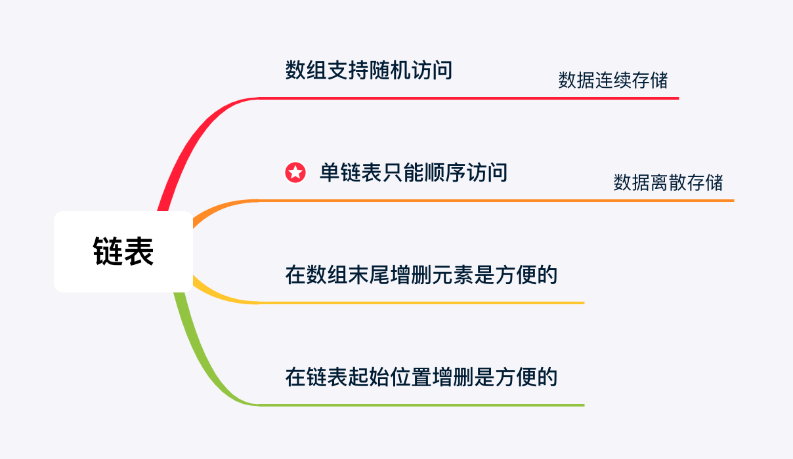

> 参考：(有具体的练习题)
> - https://leetcode.cn/leetbook/read/learning-algorithms-with-leetcode/5e0w5d/
> - https://leetcode.cn/problems/reverse-linked-list/solutions/36710/dong-hua-yan-shi-206-fan-zhuan-lian-biao-by-user74/

# 链表

1. 链表是一个真正 **动态** 的数据结构，数组是一个 **静态** 的数据结构
2. 创建数组，需要人为设置数组大小，而创建链表则不需要，这一点是由数组和链表中的数据，在内存中组织方式的不同决定的
3. 数组中的数据在内存中是连续的。当前连续的数据区域用完了以后，如果还需要添加元素，就需要把当前数据块的元素拷贝到一个更大的连续区域，然后继续添加元素。
4. 而链表中的每一个元素，附加地保存了下一个元素的 **内存地址**，因此理论上链表中的数据可以存放在任意空闲内存区域（如果内存空间还够用的话），而不需要一开始就设置链表中需要存放多少元素。

「力扣」中的关于「链表」的问题，以「单链表」居多，并且 解题技巧相对固定 。

- 在学习和解题的过程中一定不能忽视 画图分析 的作用。
- 在脑子里想象解题思路，不如在草稿纸上真正把思考的过程画出来，请大家一定不要犯懒。
- 另外，还要重视 调试代码 的作用，一些很细节的地方，需要通过调试，看到控制台的输出，才能发现程序出错的原因。

# 链表分为单链表和双链表

1. 单链表中的每个结点不仅包含值，还包含链接到下一个结点的引用字段。
2. 通过这种方式，单链表将所有结点按顺序组织起来。例如：

3. 在大多数情况下，我们将使用头结点(第一个结点)来表示整个列表。

# 链表问题概述

## 1. 数组支持随机访问
由于数组中的数据在内存中是 连续 存放的，通过数组下标的可以以 O(1) 的时间复杂度访问到元素的值。

使用如下公式可以计算出数组里下标为 i 的元素地址，然后读取这个内存地址里的变量的值。

` 下标为 i 的元素地址 = 第1个元素的地址 + i × 数组中每个元素的大小`

公式说明：

- 内存地址连续，因此用加法；
- 相同类型的元素所占用的内存空间大小是一样的，因此用乘法。

因此要访问数组里的某个元素，程序要执行的操作数与这个元素 在数组里的位置无关 。

所以我们说，数组支持 随机访问（Random Access）`

## 2.数据散落在内存的各个部分的数据结构：链表
与数组不同的是，链表中的数据 分散 在内存的不同位置，通常由 CPU 随机分配。链表中的数据看起来是下面这样的：

* 在真正存储数据的部分后面还带着一块区域，这块区域存储了 下一个数据 的 内存地址 。
* 程序读取这个内存地址，就可以访问到下一个元素。
* 由于要保存真正的数据和下一个数据的内存地址，链表的最基本单元至少有 2 个数据块，
* 它们通过类的对象（Java、Python 语言）或者结构体（C 语言）组织起来。

这样 2 个数据块绑定在一起的整体，称为「结点」。上面的链表 [1, 2, 3] 在内存里可能是这样分布的：

* 因此只要知道了链表的第 1 个元素的地址，就能依次访问链表中的每一个元素。
* 越在链表尾部的结点，访问所需要执行的操作数（执行时间）就越多。

> 相对于数组而言，在链表中插入和删除元素是方便的，但链表丧失了随机访问的能力，只能 顺序遍历。

## 数组和链表的比较

表格说明：

① 在当前数组还没有放满元素的情况下，在数组里添加一个元素，如果添加的元素不是添加在已有数据的末尾，那么需要将待添加位置后面的所有的元素 依次向后 挪动一格，空出一个位置以后，再将空出来的位置赋值成为新添加元素的值，

- 因此时间复杂度为 O(N)（这里 N 是数组的长度）。
- 同理，在数组里删除元素的时间复杂度是 O(N)；

② 在链表里 增加 、删除 结点，只需要常数次操作，时间复杂度为 O(1)。

而在链表里访问一个结点，只能按照顺序遍历，时间复杂度为 O(N)（这里 N 是链表的长度） 。

>- 于是我们在数组里添加、或者删除元素，通常会在 数组的末尾 操作，
>- 而对链表的添加和删除，通常会在 链表的起始位置 操作。

# 双向链表
- 「双向链表」是指一个 线性结构 的每个数据以结点的方式存储，并且每一个结点除了必要的真正存放数据的区域以外 
只 含有两个存放其它结点的数据块。
- 这两个数据块分别存储了当前结点的上一个结点（前驱结点）的内存地址和下一个结点（后继结点）的内存地址。

- 双向链表的第一个结点没有前驱结点，最后一个结点没有后继结点。
- 单向链表只能从第一个结点开始按照顺序单向访问链表中的结点，每一个结点只能访问到它的后继结点，
- 而双向链表有两个指针变量，每一个结点除了能访问到它的后继结点以外，还以访问到前驱结点。
- 双向链表可以应用于 LRU 缓存机制

# 循环链表
1. 如果「单向链表」的最后一个结点指向「单向链表」的第一个结点，在逻辑上就形成了一个环形结构，这样的链表就称为「循环单向链表」。

2. 「循环单向链表」的一个经典应用是模拟约瑟夫环问题，感兴趣的朋友可以在互联网上进行搜索，我们在这里就不多做介绍了。
3. 如果「双向链表」的第一个结点的前驱结点指向链表的最后一个结点，最后一个结点后继结点指向链表的第一个结点，在逻辑上也形成了一个环形结构，这样的链表就称为「循环双向链表」。

# 总结
1. 使用数组之前，需要事先设置数组的大小，而链表没有这样的要求，是一个真正 动态 的数据结构；
2. 如果在某个场景下，只需要对线性结构的 末尾 进行增加和删除操作，那么使用数组是合适的；
3. 如果在某个场景下，只需要对线性结构的 开始 进行增加和删除操作，那么使用链表是合适的。

# 链表操作的常用方法：
1. 直接使用原来的链表来进行操作。
2. 设置一个虚拟头结点在进行操作
3. 在许多情况下，你需要跟踪当前结点的前一个结点。
4. 你可以同时使用多个指针。
5. 

# 对照
这里我们提供链表和其他数据结构（包括数组，队列和栈）之间时间复杂度的比较：

经过这次比较，我们不难得出结论：

* 如果你需要经常添加或删除结点，链表可能是一个不错的选择。
* 如果你需要经常按索引访问元素，数组可能是比链表更好的选择。