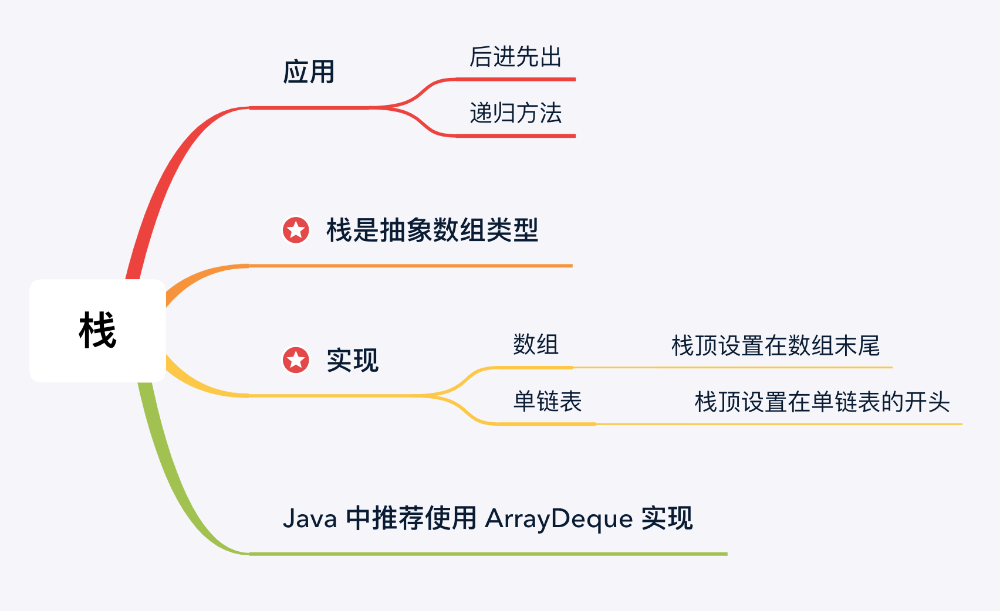
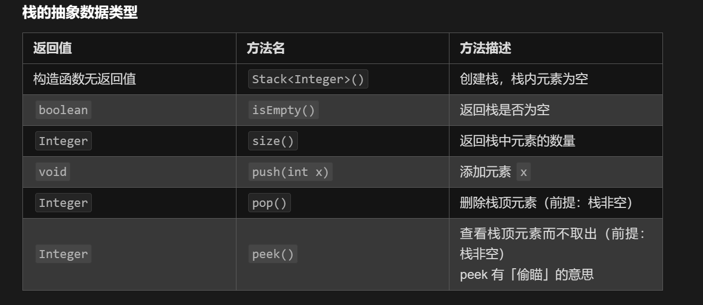

> 参考：https://leetcode.cn/leetbook/read/learning-algorithms-with-leetcode/5w6qh1/
>
> 参考:  https://labuladong.gitee.io/algo/di-yi-zhan-da78c/shou-ba-sh-daeca/dan-diao-z-1bebe/


# 栈：后进先出的数据结构


1. 「栈」是一种 后进先出 的数据结构，是一种人为规定的，只能在一端（栈顶）进行插入和删除操作，
2. 并且在栈非空的情况下，只能查看 栈顶 的元素的线性数据结构。

## 计算机中使用栈的例子：

* 进制的转换；
* 在计算机中`表达式的计算`，几乎都和栈有着密不可分的关系；
* 只要是`函数有嵌套调用`，都离不开栈的支持。
  * 因为函数的嵌套调用（特殊的例子是`递归`）就是 后面遇到的函数需要先执行，这是典型的栈的应用场景；
* 在处理 树结构 和 图结构 的一些问题中，栈发挥着非常重要的作用，这种使用栈的算法叫做 深度优先遍历 （第 11 章会介绍）。
  * 深度优先遍历通常来说是借助递归方法实现的，背后有编程语言的 `系统栈` 的支持。

## 为什么限制了「后进先出」
有一个很自然的问题，如果不做这样的限制，不是应用范围更广吗？这里涉及一些工程上设计的思想：

1. 首先，不是功能越多越好。
   - 越多的功能很可能带来更多的性能的消耗，需要更多的性能开销；
2. 其次，有安全的问题。
   * 在生活中，我们给一个人的权限越来越多，很可能会让这个人无所适从，产生差错。
   * 一个比较好的办法就是，需要什么，就给什么，并且一个人只做好份内的事情；
3. 第三，有了这些特定的数据结构，使用的时候语义也会更加清晰，便于交流。
   * 他人也更容易知道我们大概是在解决一个什么问题，
   * 使用「栈」就说明处理数据的顺序是「后进先出」。
4. 「栈」就是一种在设计上 刚刚好 ，并且功能「专一」的容器。
   * 可别小看「栈」这种看起来受限制的数据结构，它在编程的世界里有着非常广泛的应用。
   * 「后进先出」在人类的世界里看起来像是失去了公平，但是我们很多时候处理的问题，恰好符合了「后进先出」的规律。

生活中后进先出的例子：

* 吃薯片；
* 从羽毛球筒里拿羽毛球；
* 教师批改作业本；
* 餐厅服务员洗盘子。

## 抽象数据类型
下面我们介绍一个在软件设计领域比较重要的概念：抽象数据类型（Abstract Data Type，ADT）。

- 抽象数据类型是一个抽象的概念，可以将它理解为 Java 的接口，相当于一个软件说明书，定义了输入是什么、输出是什么。

- 抽象数据类型，关键字在「抽象」，只说能做什么，而不说如何实现；

- 和「循环不变量」一样，通常它们都用语言描述，只要表意清晰即可，而不必在乎用什么形式表示出来。
- 一般地，抽象数据类型会使用表格的形式给出。栈的抽象数据类型如下所示。

## 栈的抽象数据类型



---


# 单调栈

首先要和大家说明的一点是：

- 单调栈不是一个新的数据结构，**单调栈就是普通的栈**。只是利用了一些巧妙的逻辑，使得每次新元素入栈后，**栈内的元素都保持有序**
  - 单调递增或单调递减
- 对单调栈中元素的加入和取出依然要满足 **后进先出** 的原则。


用单调栈解决的问题的特点是（有个印象就好，无需记忆）：找出当前元素左边（或者右边）第 1 个比当前元素大或者小的那个元素。


事实上，我们只需要在纸上模拟一下，就容易看出，其实这样的规律是显然的：

- 保持栈中元素单调性的同时，新栈顶元素就是当前栈顶元素左边第 1 个比当前元素大或者小的那个元素 。


对于使用单调栈解决的问题，

1. 一般先考虑暴力解法，
2. 然后从 **用空间换时间** 角度出发，看看解决这个问题的过程中是否符合 **后进先出** 的规律，进而考虑 **栈** 是否能够帮助我们高效地解决这个问题。


## 应用1：下一个更大元素

> 输入一个数组 nums，请你返回一个等长的结果数组，结果数组中对应索引存储着下一个更大元素，如果没有更大的元素，就存 -1。
>
> 
>
> 比如说，输入一个数组 nums = [2,1,2,4,3]，你返回数组 [4,2,4,-1,-1]。
>
> - 第一个 2 后面比 2 大的数是 4; 
> - 1 后面比 1 大的数是 2；
> - 第二个 2 后面比 2 大的数是 4; 
> - 4 后面没有比 4 大的数，填 -1；
> - 3 后面没有比 3 大的数，填 -1。

这道题的暴力解法很好想到，就是对每个元素后面都进行扫描，找到第一个更大的元素就行了。但是暴力解法的时间复杂度是 O(n^2)。

```python
# todo 单调栈 + 字典 O(n)
def nextGreaterElement(nums1: List[int], nums2: List[int]) -> List[int]:
    # 字典存放nums2所有数字对应的下一个最大元素
    dic = {}
    # 栈存放nums2倒序遍历，下一个比当前元素大的值的单调递减数组
    stack = []
    for val in reversed(nums2):
        while stack and val >= stack[-1]:
            stack.pop()
        dic[val] = stack[-1] if stack else -1
        stack.append(val)

    # 查找nums1中元素
    ans = [dic[val] for val in nums1]
    return ans
```

这就是单调队列解决问题的模板。for 循环要从后往前扫描元素，因为我们借助的是栈的结构，倒着入栈，其实是正着出栈。


这个算法的时间复杂度不是那么直观，如果你看到 for 循环嵌套 while 循环，可能认为这个算法的复杂度也是 O(n^2)，但是实际上这个算法的复杂度只有 O(n)。
分析它的时间复杂度，要从整体来看：

- 总共有 n 个元素，每个元素都被 push 入栈了一次，而最多会被 pop 一次，没有任何冗余操作。
- 所以总的计算规模是和元素规模 n 成正比的，也就是 O(n) 的复杂度。


## 应用2：去除字符串中重复的字母

使用单调栈来维护去除「关键字符」后得到的字符串


> 给你一个字符串 s ，请你去除字符串中重复的字母，使得每个字母只出现一次。需保证 返回结果的字典序最小（要求不能打乱其他字符的相对位置）。


1. 单调栈满足栈底到栈顶的字符递增。如果栈顶字符大于当前字符 s[i]，说明栈顶字符为「关键字符」，故应当被去除。
2. 去除后，新的栈顶字符就与 s[i] 相邻了，我们继续比较新的栈顶字符与 s[i] 的大小。
3. 重复上述操作，直到栈为空或者栈顶字符不大于 s[i]。


我们还遗漏了一个要求：原字符串 s 中的每个字符都需要出现在新字符串中，且只能出现一次。为了让新字符串满足该要求，之前讨论的算法需要进行以下两点的更改。

1. 在考虑字符 s[i] 时，如果它已经存在于栈中，则不能加入字符 s[i]。为此，需要记录每个字符是否出现在栈中。
2. 在弹出栈顶字符时，如果字符串在后面的位置上再也没有这一字符，则不能弹出栈顶字符。为此，需要记录每个字符的剩余数量，当这个值为 0 时，就不能弹出栈顶字符了。


```python
class Solution:
    def removeDuplicateLetters(self, s: str) -> str:
        lastIndex = {}
        stack = []
        # 创建字典lastIndex
        for i, ch in enumerate(s):
            lastIndex[ch] = i
        # 再遍历一次s,去除重复字符。并保证字典序最小
        for i, ch in enumerate(s):
            # 直接使用栈来判断是否已经存在字符。
            if ch in stack:
                continue
            # 在 ① 栈非空，② 当前元素字典序 < 栈顶元素，并且 ③ 栈顶元素在以后还会出现，弹出栈元素
            while stack and stack[-1] > ch and i < lastIndex[stack[-1]]:
                stack.pop()
            # stack保存遍历过的字符
            stack.append(ch)
        return ''.join(stack)
```

