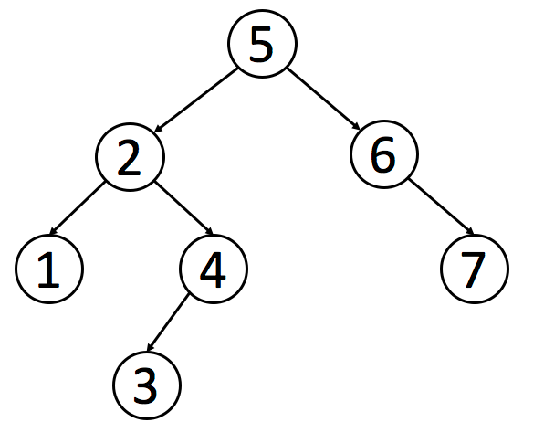

>参考：
> - https://leetcode.cn/tag/binary-search-tree/problemset/
> - https://labuladong.github.io/algo/di-yi-zhan-da78c/shou-ba-sh-66994/dong-ge-da-8f403/

# 二叉搜索树
二叉查找树（英语：Binary Search Tree），也称为 二叉搜索树、有序二叉树（Ordered Binary Tree）或排序二叉树（Sorted Binary Tree），是指一棵空树或者具有下列性质的二叉树


## BST 的特性
1. 对于 BST 的每一个节点 node，左子树节点的值都比 node 的值要小，右子树节点的值都比 node 的值大。
2. 对于 BST 的每一个节点 node，它的左侧子树和右侧子树都是 BST。
3. 没有键值相等的节点。

- 直接基于 BST 的数据结构有 AVL 树，红黑树等等，拥有了自平衡性质，可以提供 logN 级别的增删查改效率；
- 还有 B+ 树，线段树等结构都是基于 BST 的思想来设计的。
- 二叉搜索树作为一种经典的数据结构，它既有链表的快速插入与删除操作的特点，又有数组快速查找的优势；
- 所以应用十分广泛，例如在文件系统和数据库系统一般会采用这种数据结构进行高效率的排序与检索操作。


像普通的二叉树一样，我们可以按照前序、中序和后序来遍历一个二叉搜索树。
但是值得注意的是，对于二叉搜索树，我们可以通过`中序遍历`得到一个`递增`的有序序列。

因此，中序遍历是二叉搜索树中最常用的遍历方法。

```python
# 也就是说，如果输入一棵 BST，以下代码可以将 BST 中每个节点的值升序打印出来：
def traverse(root):
    if not root:
        return
    traverse(root.left)
    # 中序遍历代码位置
    print(root.value)
    traverse(root.right)

```


