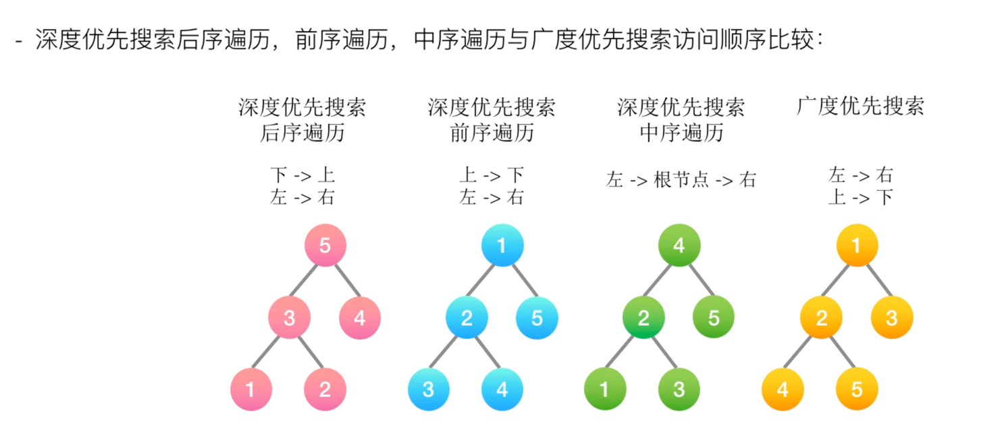

# 对于二叉树的题目，无非就以下几种解题思路：

1. 先序遍历（深度优先搜索）
2. 中序遍历（深度优先搜索）（尤其二叉搜索树）
3. 后序遍历（深度优先搜索）
4. 层序遍历（广度优先搜索）（尤其按照层来解决问题的时候）
5. 序列化与反序列化（结构唯一性问题）

# 二叉树解题的思维模式分两类：
## 1.是否可以通过遍历一遍二叉树得到答案？
如果可以，用一个 `traverse` 函数配合`外部变量`来实现，这叫「遍历」的思维模式。

## 2.是否可以定义一个递归函数，通过子问题（子树）的答案推导出原问题的答案？
如果可以，写出这个递归函数的定义，并`充分利用这个函数的返回值`，这叫「分解问题」的思维模式。

## 无论使用哪种思维模式，你都需要思考：
- 如果单独抽出一个二叉树节点，它需要做什么事情？需要在什么时候（`前/中/后序位置`）做？
- 其他的节点不用你操心，递归函数会帮你在所有节点上执行相同的操作。

# 二叉树的构造问题
二叉树的构造问题一般都是使用「分解问题」的思路：
- 构造整棵树 = 根节点 + 构造左子树 + 构造右子树。
- 先找出根节点，然后根据根节点的值找到左右子树的元素，进而递归构建出左右子树。

# 后序位置的妙用
- 前序遍历：root + 左子树遍历 + 右子树遍历
- 中序遍历：左子树遍历 + root + 右子树遍历
- 前序遍历：左子树遍历 + 右子树遍历 + root

前序位置的代码只能从函数参数中获取父节点传递来的数据，而后序位置的代码不仅可以获取参数数据，还可以获取到子树通过函数返回值传递回来的数据。

那么换句话说，**一旦你发现题目和子树有关，那大概率要给函数设置合理的定义和返回值，在后序位置写代码了。**
