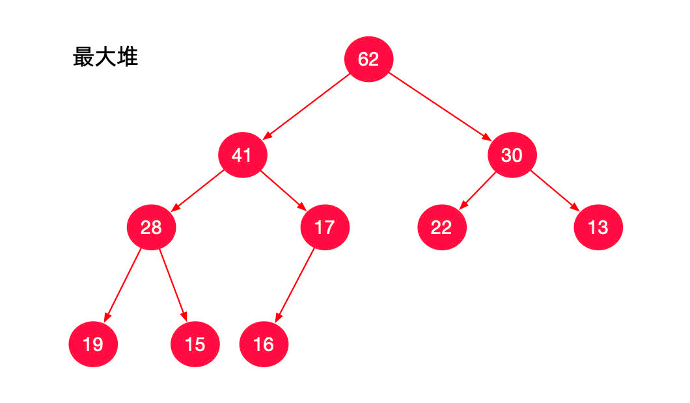

> 参考：
> - https://suanfa8.com/priority-queue
> - https://labuladong.github.io/algo/di-yi-zhan-da78c/shou-ba-sh-daeca/er-cha-dui-1a386/
> - [零起步学算法 - LeetBook - 力扣（LeetCode）全球极客挚爱的技术成长平台](https://leetcode.cn/leetbook/read/learning-algorithms-with-leetcode/50rqgc/)

# 一、优先级队列简介


## 1「优先队列」与「堆」的关系
python的优先级队列：
> 官方文档： https://docs.python.org/zh-cn/3.9/library/queue.html#queue.PriorityQueue
* 优先队列（Priority Queue）是一种「抽象的」数据结构；
* 而堆（Heap）是具体的实现，这个系列我们只讲「二叉堆」，其它「优先队列」的实现不涉及。

## 2 优先队列用于解决什么样的问题
>「优先队列」是从这样的场景中抽象出来的数据结构：
> - 班级里要选一名同学代表全班参加程序编程竞赛，此时我们只会关心第 1 名是谁。
> - 如果第 1 名不想参赛了，或者说第 1 名因为其它因素不符合参考资格，我们才考虑第 2 名，但也是从（除了第 1 名以外）剩下的那些同学中挑出第 1 名。

我们 只关心当前「最优」的那个元素，第 2 名、第 3 名直到最后一名都不考虑了。

* 「优先队列」相对于「普通队列」而言，「普通队列」的性质是「先进先出，后进后出」。
* 「优先队列」由元素的 优先级 决定出队的顺序。

## 3 更多「优先队列」在生活中的例子
「优先队列」更多地应用于动态的情况，即数据不是一开始就定好的，而是随时都有可能来新的数据，此时新数据与旧数据在一起选出「优先级」最高的那个元素。


比如以下场景，重点理解「动态执行」这个概念：

1. 医院看病：重症患者往往优先治疗，即使他（她）是后来者；
2. 操作系统：选择优先级最高的任务执行；
3. 上网：服务端依次回应客户端的请求：通常也是使用优先队列，优先级高的客户端优先响应；


下面是一个静态的例子： 

例：从 1000000 个数中选出最大的 100 个数。


这个问题我们抽象成数学表达就是：在 N 个元素中选出前 M 个元素。

1. 如果我们使用之前学习的排序算法，时间复杂度为： O(NlogN)，即先排序，再取出前 M 个元素。
   - 此时问题的时间复杂度完全由使用的排序算法决定；
2. 如果我们使用优先队列，那么解决该问题的时间复杂度为： O(NlogM)。
   - 与使用排序算法不同之处在于，我们只要维护有 M 个元素的数据结构就可以了，
   - 通常来说在这样的问题场景下 M 是远小于 N 的，
   - 例如上面说的「从 1000000 个数中选出最大的 100 个数， N=1000000， M=100」。


# 二、优先队列的实现

## 优先队列的几种实现方式
可以很容易地想到「优先队列」有两种实现方式：「无序数组」和「有序数组」。

### 实现一：无序数组
- 入队：放入的时候，直接放在数组的末尾，时间复杂度： O(1)；
- 出队：每次拿出元素之前，我们都执行一次排序，或者像「选择排序」那样，把最大的那个拿出去（其他操作不赘述），时间复杂度是： O(N)，这里 N 是数组的长度。

### 实现二：有序数组
* 入队：每次放入元素的时候，我们都执行一次排序，类似于「插入排序」的内层循，保持数组的有序性，时间复杂度 O(N)。
* 出队：把最大的那个拿出去 O(1)（其他操作不赘述）。

下面这个结论很重要：

>- 可以看出，讲「优先队列」设计成线性结构，出队或者入队的时候，其中有一个操作一定是 O(N) 的，
>- 也就是说「出队」或者「入队」其中一个操作一定是 O(N)。

----------

# 三、堆 heap
伟大的计算机科学家平衡了入队和出队这两个操作的时间复杂度，这种数据结构就是「堆」。

> python官方文档：
> https://docs.python.org/zh-cn/3.9/library/heapq.html?highlight=heap#module-heapq

* 也就是说，不管是「入队」还是「出队」，总有一个操作得把「优先队列」中的元素都看一遍。
* 而「堆」就是这样一个数据结构，能把 O(N) 降到 O(logN)。

| 实现优先队列的数据结构 |  入队操作   | 出队操作    |
|:-----------:|:-------:|---------|
|    普通数组     |  O(1)   | O(N)    |
 |    顺序数组	    |  O(N)   | O(1)    |
 |      堆      | O(logN) | O(logN) |

说明： logN 表示以 2 为底的 N 的对数，在时间复杂度的概念下，我们一般忽略底数。


原因是 换底公式，具体推导请见 时间复杂度与空间复杂度，在这个文档里面搜索「对数或者是含有对数乘法因子的项，对数底都看作 2」。

以在 N 个元素中选出前 M 个元素为例。使用「有序数组」或者「无序数组」，最差情况下时间复杂度是 O(N^2 )，使用「堆」可以将时间复杂度降到： O(NlogM)。`事实上，时间复杂度是 O(N^2 ) 与 O(NlogM) 的差异巨大的。`


理解这个事实是我们掌握「堆」以及相关算法的基础，正是因为使用「堆」这种数据结构，提高了我们算法的执行效率，我们才有必要研究「堆」，使用「堆」。

>1. 综上所述，「堆」是实现「优先队列」的高效的数据结构。
>2. 根据出队的元素是 当前 整个队中最大的那个元素或者是最小的那个元素，「堆」有「最小堆」和「最大堆」之分。

### 最大堆与最小堆
「优先队列」是一种常见的数据结构，有两种「优先队列」。

1. 一种「优先队列」每次可以从中拿到人为定义下、当前优先级「最高」的元素，即「最大堆」「大顶堆」「大根堆」；
2. 另一种「优先队列」每次可以从中拿到人为定义下、当前优先级「最低」的元素，即「最小堆」「小顶堆」「小根堆」。

可以看到，「堆」的入队和出队的时间复杂度都是 O(logn) ，因此我们可以猜测 组织「堆」的结构是一棵树。

### 二叉堆 Binary Heap 的定义
形如下面形状的一个结构就是「最大堆」。


#### 第 1 条：「最大堆」是一棵「完全二叉树」

完全二叉树：从形状上看，除了最后一层之外，其它层结点的数量达到最大值，并且最后一层的结点全部集中在左侧。

>「完全二叉树」的特点是：
> 1. 可以使用一个数组保存「完全二叉树」，而不必引入离散的树形结构，因为在通常情况下，操作数组的下标，比操作结点和指针要方便一些。（这一点非常重要，请读者仔细体会）。
> 2. 这样既可以利用数组元素可以快速访问的特点，又让结点和结点之间形成了「父」与「子」的结构关系。

#### 第 2 条：任意一个结点，如果它有孩子结点的话，孩子结点的值一定不会大于父亲结点的值

* 如果一个数组中的元素，有如上特点，我们称之为 堆有序。
* 「堆有序」不是我们通常理解意义上的「升序」或者「降序」。
* 如果把数组排成「完全二叉树」的样子，且满足第 2 条，这个数组就是「堆有序」。

>这里要注意的是，通常数组的 0 号下标不使用，从 1 号下标开始使用。
>- 这只是一种习惯，因为这么做父子结点的下标关系更「好看」一些，仅此而已。
>- 有些时候也会使用从 0 号下标开始的堆，例如「堆排序」就是这样。

#### 从下标为 1 开始的数组实现的二叉堆的性质

- 我们自己画一个二叉堆（如下图），把下标标注在二叉堆上。

- 从上到下、从左到右，从 1 号下标开始标记，即下图结点的旁边黑色的数字，我们不难发现这些数字的排列形成的规律。


从 1 开始编号的下标的规律：

- 规律 1：一个结点的左结点的下标是这个结点的下标的 2 倍；
- 规律 2：一个结点的右结点的下标是这个结点的下标的 2 倍 + 1。

因此
- 找父节点 `parent(i) =i/2 (向下取整)`
- 找子节点 `leftChild = 2 * i`   `rightChild = 2 * i + 1`

上面这张图用数组表示出来就是一个最大堆，它在我们的程序中是这样表示的：

|      |      |     |     |     |     |     |     |     |     |     |     |
|------|:----:|-----|-----|-----|-----|-----|-----|-----|-----|-----|-----|
| 下标号  |  0   | 1   | 2   | 3   | 4   | 5   | 6   | 7   | 8   | 9   | 10  | 
 | 元素值	 | None | 62  | 41  | 22  | 28  | 30  | 16  | 17  | 13  | 19  | 15  |


* 在这里啰嗦一句，如果我们使用树结构来保存上面那张图的数据，我们要创建 10 个结点，并且还要指明它们之间的引用关系，那样做显然就太复杂了。

* 这里请读者再次体会使用`数组`来表示一个`完全二叉树`的好处。

  

下面给出了使用数组实现「最大堆」的一个基本结构

```python
class MaxHeap:
    def __init__(self, capacity):
        # 我们这个版本的实现中，0 号索引是不存数据的，这一点一定要注意
        # 因为数组从索引 1 开始存放数值
        # 所以开辟 capacity + 1 这么多大小的空间
        self.data = [None for _ in range(capacity + 1)]
        # 当前堆中存储的元素的个数
        self.count = 0
        # 堆中能够存储的元素的最大数量（为简化问题，不考虑动态扩展）
        self.capacity = capacity

    def size(self):
        """
        返回最大堆中的元素的个数
        :return:
        """
        return self.count

    def is_empty(self):
        """
        返回最大堆中的元素是否为空
        :return:
        """
        return self.count == 0

```


# 四、python3中的优先队列算法

python3优先队列有两个，`heap`和`PriorityQueue`。


## 1 head

heap默认支持最小堆，也只支持最小堆


```py
# 注意：python3的heap只支持最小堆
import heapq
 # 创建一个空的堆
heap = []
 # 向堆中添加元素(优先级，数据)
heapq.heappush(heap, (5, 'data1'))
heapq.heappush(heap, (3, 'data2'))
heapq.heappush(heap, (4, 'data3'))
 # 从堆中弹出元素
item = heapq.heappop(heap)  # 3
print(item)
 # 获取堆中最小的元素
item = heap[0]  # 4
print(item)
```


## 2.PriorityQueue

参见源码


#  拓展：完全二叉树和满二叉树的区别


> [LeetCode - 1705 吃苹果的最大数目_leetcode - 1705 吃苹果的最 数 _伏城之外的博客-csdn博客-CSDN博客](https://blog.csdn.net/qfc_128220/article/details/127695013?ops_request_misc=%7B%22request%5Fid%22%3A%22170134830016800192256289%22%2C%22scm%22%3A%2220140713.130102334.pc%5Fblog.%22%7D&request_id=170134830016800192256289&biz_id=0&utm_medium=distribute.pc_search_result.none-task-blog-2~blog~first_rank_ecpm_v1~rank_v31_ecpm-1-127695013-null-null.nonecase&utm_term=苹果&spm=1018.2226.3001.4450)


优先队列通常采用堆结构来实现，所谓堆结构，即一颗完全二叉树。


那么什么是完全二叉树呢？


> 一棵深度为k的有n个结点的二叉树，对树中的结点按从上至下、从左到右的顺序进行编号，如果编号为i（1≤i≤n）的结点与满二叉树中编号为i的结点在二叉树中的位置相同，则这棵二叉树称为完全二叉树。


由上图我们可知，完全二叉树的最深的一层如果节点不满的话，则会优先填满左边。 

并且完全二叉树中某节点的序号为k的话，则其左孩子节点的序号必然为2k+1，其右孩子节点的序号必然为2k+2。


**因此上面的完全二叉树可以用数组来进行模拟：**


可以发现数组的索引刚好就是完全二叉树节点的序号。 


堆结构对应的完全二叉树需要满足以下两个条件之一：

- 父节点要大于或等于其左右孩子节点，此时堆称为最大堆
- 父节点要小于或等于其左右孩子节点，此时堆称为最小堆

这样的话，堆结构才能快速地找到最值节点，即堆结构的顶点。


## 堆结构模拟优先队列，主要就是实现优先队列的入队和出队操作。

当我们向堆结构中入队一个新元素，需要先将新元素加入到堆结构对应的数组的尾部，但是这样的话可能会破坏堆结构的顺序性，因此我们需要通过上浮操作，来调整堆的顺序。


## 1. 关于上浮操作，请看下面示例：

如下图，是一个最大堆，父节点的值总是大于其左右子孩子节点的值


 现在我们需要向堆中新增一个元素29，则先放在尾部，假设此时29的序号为k，则其父节点的序号必然为 Math.floor((k-1)/2)


然后比较29和其父节点值得大小，如果29 > 父节点值，则交换节点的值，完成29的上浮行为


然后继续比较，29和其父节点值的大小， 如果29 > 父节点值，则交换节点的值，完成29的上浮行为


直到，29发现其小于等于父节点值时，停止上浮，或者29已经上浮到k=0序号位置，即顶点位置时，停止上浮。


**当我们需要优先队列出队时，即出队头，此时相当于堆结构删除堆顶元素**，但是我们不能冒失的直接将堆顶元素删除，这样会让堆结构散架。


好的做法，是将堆顶元素和堆尾元素值交换，然后将堆尾元素弹出（堆结构可以用数组模拟，因此可以使用pop操作） ，但是此时堆顶元素的值其实并非最大

值，因此我们需要使用下沉操作来调整堆结构，维护其顺序性。


## 关于下沉操作，我们可以看如下示例：

下图是一个最大堆，我们现在需要删除堆顶30


 则第一步是交换堆顶元素和堆尾元素的值，然后将堆尾元素弹出


此时最大堆的顺序性被破坏，我们开始执行下沉操作，所谓下沉操作，即将破坏顺序性的节点12和max(左孩子值，右孩子值) 比较，**若12< max(左孩子值，右孩子值)，则交换**


当下沉到没有左右孩子，或者大于等于max(左孩子，右孩子)时，即停止下沉。


我们可以发现，使用堆结构模拟的优先队列，每次入队都会触发上浮操作，每次出队都会触发下沉操作，但是**上浮和下沉的次数最多就是完全二叉树的深度**，而完全二叉树的深度为logN，也就是说堆结构维护的优先队列每次入队和出队的时间复杂度为O(logN)，这要比使用有序数组维护的优先队列的入队出队的时间复杂度O(n)，大大提升了效率。

 


