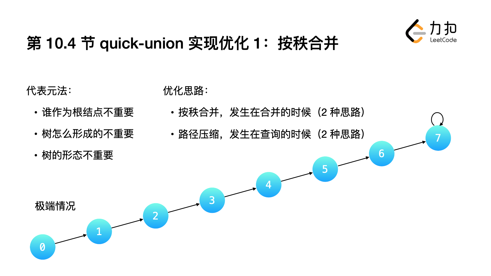

> 参考:
>
> https://labuladong.gitee.io/algo/di-yi-zhan-da78c/shou-ba-sh-03a72/bing-cha-j-323f3/
> https://leetcode.cn/leetbook/read/learning-algorithms-with-leetcode/57iag6/
>
> [算法吧 | 快来算法吧 (suanfa8.com)](https://suanfa8.com/union-find/design-thinking)


# 并查集的设计思想

**提示**：

- 「并查集」是一种建立在「数组」上的树形结构，并且这棵树的特点是 **孩子结点指向父亲结点** ；
- 「并查集」主要用于解决「动态连通性」问题，重点关注的是连接问题，并不关注路径问题；
- 「并查集」是树，所以优化的策略依然是和树的高度较劲，优化思路有「按秩合并」与「路径压缩」。

「并查集」主要知识点如下：


「并查集」这部分知识点讲得最清楚的是《算法（第 4 版）》，本篇「并查集」的介绍是我看这本书第 1.5 节的学习笔记。


## 什么是「并查集」

我们知道，「堆」是一种建立在数组上的「树结构」，在这一章，我们向大家介绍的数据结构同样也是建立在数组上的树结构，这个数据结构叫做「并查集」（Union-Find），「并查集」也叫做「不相交集合」（Disjion-Sets）。

「并查集」的设计思想很简单，易于理解，且代码编写容易，难点在于如何应用并查集的思想解决问题。能够使用并查集解决的问题一般来说都比较生活化，还比较有趣。

在这里需要和大家说明的是：并查集的问题在面试中的占比较少，并且由于并查集问题通常不以并查集为背景，故「力扣」上「并查集」的问题一般被标记为「中等」和「困难」。


# 1.并查集的 quick-find 实现


`quick-find` 的设计思想在我们的生活中并不少见：

* 在工作场合，我们会穿着指定的工作服，表明我们是同事关系；
* 情侣或孪生兄弟，会身着情侣装和相同的衣服；
* 古时候两军交战，双方士兵会身着不同颜色的战袍，以分清敌我。


## quick-find 基于 id 的思想：
* 给每一个组一个编号，这个编号称为 id ， **如果两个元素的 id 一样，就认为它们同属于一个集合**
  * 时间复杂度为 O(1)。
* **要想合并两个组，就需要将它们的 id 设置成一样**。在最差情况下，需要修改几乎整个数组元素的 `id`
  * 时间复杂度为 O(N)。

所以这一版并查集「查询」快，但是「合并」慢。


## 例：「力扣」第 547 题：朋友圈


# 2.并查集的 quick-union 实现


## 代表元法
在日常生活中也有这样场景：
- 两个公司或者集团，他们宣布合并，但事实上他们的网站还是各自的网站，没有改名字，
- 不同的是 其中一个公司宣布成为另一个公司的子公司。

并查集基于 quick-union 思想的实现也是类似的：
1. 我们为每一个不相交的集合设置一个代表元素来标识这个元素。一开始和 quick-find 一样，所有的元素都是独立的。
2. 只要有发生合并，不是修改标识，而是 `把其中一个元素的根结点的链接指向另一个元素的根结点` ，这里「链接指向」是通过 parent 数组体现的，请见参考代码； 
3. 在这种合并的过程中，就形成一棵树又一棵树，这些树的特点是：没有公共结点，于是形象地被我们称为「森林」； 
4. 在查询的时候，稍微费点事，一定要查询到结点所在树的 `根结点`，根结点相同，才能够说明两个结点在一个集合中。

## quick-find 的设计思想是：
为每一个集合选出一个代表元素，这个代表元素位于这棵树的 根结点，因此也叫 `代表元法` 。


---


# 3.代码示例

参考 leetcode 547题

# quick-union 实现优化 1：按秩合并


在合并的过程中，可能会出现这样的情况：一棵树变成了链表。

树的问题，绝大多数情况下优化的方向是： `让树的高度更低`，这一点是显然的（如果查找的结点里根结点越近，程序就会越快返回)。

在查询的时候，我们希望棵树的高度越低越好。

## 1.按照 size 合并


一种 直觉上 优化的思路是「大吃小」：
* 把 结点个数 较少的树的根结点指向结点个数较多的树的根结点。
* 这有点像公司合并，财大气粗、实力雄厚的大公司「吞并」小公司。
* 这种合并的优化策略称为「按照 size 合并」。


## 2.按照 rank 合并
* 另一种更合理、更直接的做法是：`将 高度 较低树的根结点指向 高度 较高的树的根结点`，
* 这样合并以后不会增加树的高度（合并之前两棵树高度相等的情况，合并以后其中一个树的高度增加 1）。


这种合并两个集合的优化称之为「按照 rank 合并」或者「按秩合并」。


这里称为「秩」的原因有 2 点：

* 秩是高度和结点数大小的统称，都表示需要根据的一些信息进行合并；
* 在添加了「路径压缩」（下一节介绍）优化以后，树的高度的定义已经不准确，转而使用「秩」来表示这种不准确的定义（没有必要维护树的高度的准确定义）

## 总结
1. 按秩（高度、size）合并发生在两棵树合并的过程中。
2. 遵循的规则是： 
   1. 优化前与优化后的树 等价，但是高度更小。 
   2. 优化策略是代表元法的应用：只要根结点一样，谁作为根结点不重要，树的形态不重要，树是怎么形成的也不重要。


# quick-union 实现优化 2：路径压缩
**按秩合并** 是指在「合并」两个集合的时候的两个参考依据：

* 根结点的树的结点个数 size；
* 根结点的树的高度 rank。

二者选择其中一个。


**路径压缩**，是在「查找」的过程中，使得树的高度变得更低，这是并查集特有的操作：**边查边改**。

1. 依然是根据 **代表元法** 的设计思路：**树的形态**并不重要。
2. 基于这一点，在「查找」的过程中，可以顺便修改结点的指向，好让以后再查询的时候，能够更快地查找到某个结点所在的树的根结点。


路径压缩也有两种方式，它们是隔代压缩和完全压缩。


---


## 路径压缩的思路 1：隔代压缩


「隔代压缩」的意思是：让查询过程中经历的 **部分结点** 指向它的父亲结点的父亲结点。相对于「完全压缩」而言，压缩没有那么彻底。

说明：上面这张图需要这样理解：对结点 0 执行一次查询根结点操作：

* 把结点 0 指向它的父亲结点的父亲结点 2；
* 此时结点 0 的新的父亲结点是结点 2，再把结点 2 指向 2 的父亲结点的父亲结点 4；
* 结点 4 的父亲结点就是它自己，因此结点 4 就是整棵树的根结点，返回 4。


在查询的过程中，结点 0 的所有祖先结点中，结点 0 和结点 2 改变了它父亲结点的指向，**结点 1 和结点 3 不变**，呈现出「隔代压缩」的特点。

在代码层面，只需要在原来代码的基础上，添加一行代码即可。
```python
def find(self, x:int) {
    while x != parent[x]:
        # 路径压缩：隔代压缩
        parent[x] = parent[parent[x]];
        x = parent[x];
    }
    return x;
}
```

## 路径压缩的思路 2：完全压缩!!!
「完全压缩」的意思是：让查询根结点的过程中，沿途经过的 所有结点 指向都指向根结点


* 观察「压缩前」与「压缩后」树的形态变化，联想程序执行的过程，从 4→3→2→1→0 （根结点）。
* 查询到根结点以后，结点 1 先指向根结点 0，结点 2 指向根结点 0 ... ，
* 后遍历到的结点先执行改变父结点到根结点的操作，符合 **后进先出** 规律，显然需要使用 **栈** 作为辅助数据结构，
* 这一操作可以借助「递归」完成。

```python
def find(self, x: int) -> int:
    """返回val为x的节点的根节点val
    路径压缩：完全压缩
    """
    if x != self.parent[x]:
        # find(parent[x]) 会返回树的根结点，
        # parent[x] = find(parent[x]) 会将沿途经过的结点的父亲结点都指向根结点
        self.parent[x] = self.find(self.parent[x])
    # 输入 x 没有发生变化，应返回 x 的父亲结点，才表示树根结点
    return self.parent[x]

```


## 同时使用按秩合并与路径压缩

并查集的时间复杂度分析，其理论性较强，通常只需要知道结论即可。这里介绍一个结论：

> 同时使用按秩合并与路径压缩时，最坏情况的时间复杂度为 O(mα(n))，这里 α(n) 是一个增长非常慢的函数，α(n)≤4。


可以 感性 地这样理解结论：

1. 由于路径压缩采用「一边查询，一边修改树结构」的策略，并且 修改树的结构是不可逆的，合并之前需要先查询再合并。

2. 如果次数非常多的话，最后并查集里所有的树的高度都只有 2，平均到每一次「合并」和「查询」操作，时间复杂度是常数次的。


## 两种路径压缩策略的比较
下面我们比较两种压缩策略。第 1 种虽然压缩不完全，但是这种压缩有些时候是恰到好处的：

1. 首先，在代码层面相对好理解；

2. 其次，在性能方面是胜于「完全压缩」的。这是因为「完全压缩」需要先从查询点开始遍历，一直遍历到根结点，然后再把沿途经过的结点指向根结点，有「一来一回」的过程，从查询结点到根结点的路径要走 2 次；

3. 「隔代压缩」在循环中完成，而「完全压缩」需要借助递归，得遍历两次。

   

虽然完全压缩是最理想的情况，但是隔代压缩经过多次查找也能够达到和完全压缩等价的效果。在有些问题下，必须使用完全压缩。


我们在「力扣」第 399 题：除法求值 的例题讲解中，会向大家指出，这个问题必须使用完全压缩，才符合问题的语境。


## 经验

以下是几点经验：

- 「按秩合并」与「路径压缩」两个优化只使用一种就可以了，有些时候只写「路径压缩」就能得到一个不错的结果；

- 有些并查集问题即使「按秩合并」与「路径压缩」同时使用，时间依然消耗很多。

- 「路径压缩」和「按秩合并」一起使用的时候，难以维护「秩」准确的定义，但依然具有参考价值。这是因为，虽然 rank 不是此时树的精确高度，但是不会出现树 a 的高度比树 b 结点高，但是树 a 的 rank 却比树 b 的 rank 低的情况。

  


