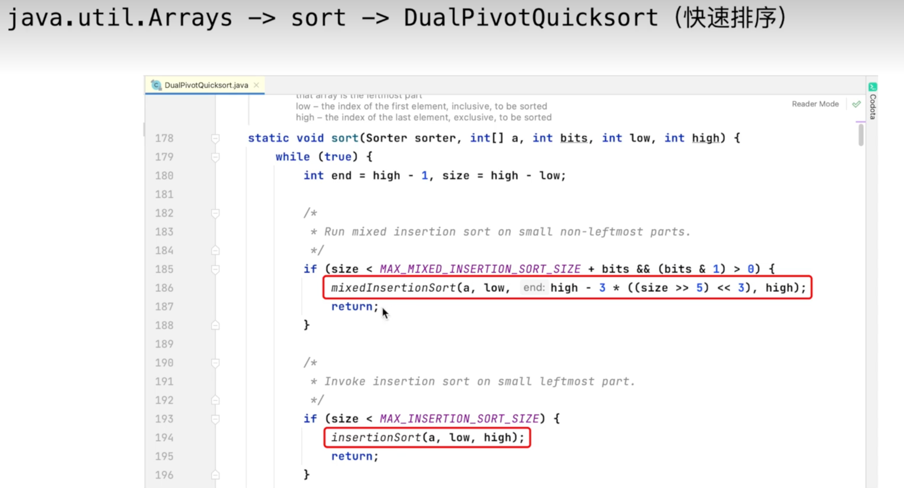
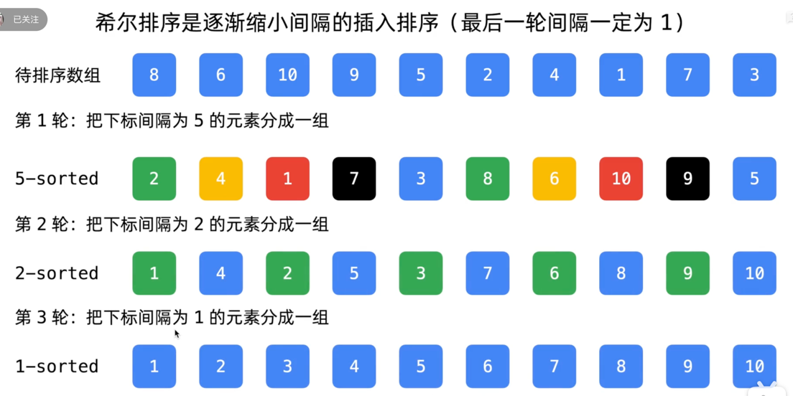

> 参考：[零起步学算法 - LeetBook - 力扣（LeetCode）全球极客挚爱的技术成长平台](https://leetcode.cn/leetbook/read/learning-algorithms-with-leetcode/xs6vc5/)
>
> 视频：https://vip1.cyou/aQb

# 1.选择排序的特点
1. 执行时间与顺序无关    
> 正序12345  逆序54321  这2个数组排序时选择和交换的次数一样
2. 交换次数最少
> 适用于交换成本较高的排序任务(在现实生活中,其实是用的最多的)

## 选择排序的优化方向
- 选择排序最耗时的部分,在于从 **未排序好的部分** 中选出 **最小元素**,需要遍历
- 从 **还未排好序的部分** 选择最值元素 ==> 优化: **堆排序**

---

# 2. 插入排序的重要意义

插入排序的优点：
1. 插入排序在「接近有序」的数组上，有较好的性能；
2. 插入排序在「数据规模较小」的排序任务上有较好的性能
> 什么是接近有序？ 
> 1. 每个元素距离他排序以后最终在的位置不远；
> 2. 或者说数值很小的元素排在最后面, 或者数值很大的元素排在最前面这2种情况很少出现

归并排序和快速排序都是基于「分治算法」
- **归并排序和快排拆分到较小子区间的时候转而使用插入排序**
- 在绝大多数情况下，插入排序应用长度为 6 到 16 之间的任意值的排序任务上都能令人满意。《算法(第 4 版)》
- java官方 sort 函数底层就是就是这样干的！也就是说一些高级排序算法的底层会转向使用插入排序！

## 插入排序优化的方向
「插入排序」可以通过「修改数组的值」完成排序任务，避免「数据交换」的性能开销，

唯一消耗的性能就只剩下遍历有序数组进行「数据大小比较」

> 说明：查找插入的位置可以使用「二分查找」，但仍然需要把比插入元素严格大的元素逐个后移，时间复杂度不变！

---

# 3.希尔排序

## 希尔排序的使用场景

>如果你需要解决一个排序问题而又没有系统排序函数可用(例如直接接触硬件或是运行与嵌入式系统中的代码)，
可以先用希尔排序，然后在考虑是否值得将他替换为更为复杂的排序算法。 --《算法(第四版)》

## 希尔排序是一种基于插入排序的算法
- 分组插入排序
- 逐渐缩小间隔的插入排序

## 希尔排序实现方法
假设数组有 10 个元素
1. 5-sorted
2. 2-sorted
3. 1-sorted

