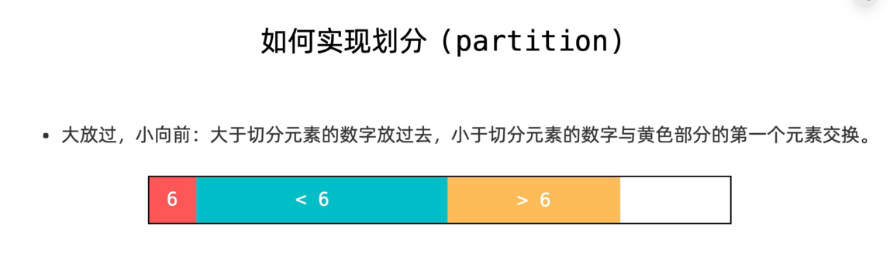
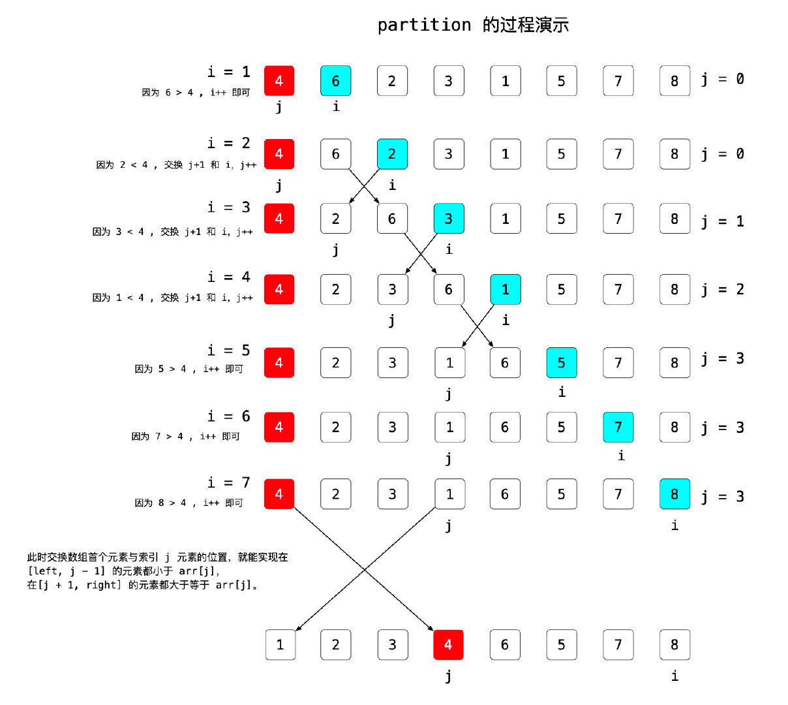
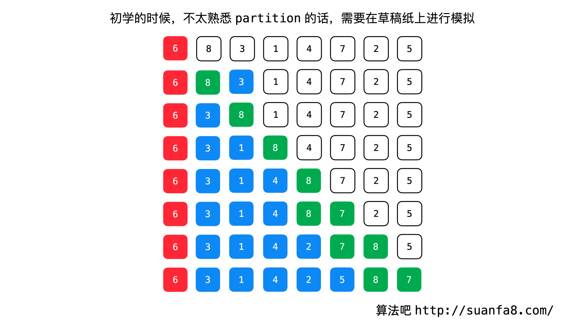
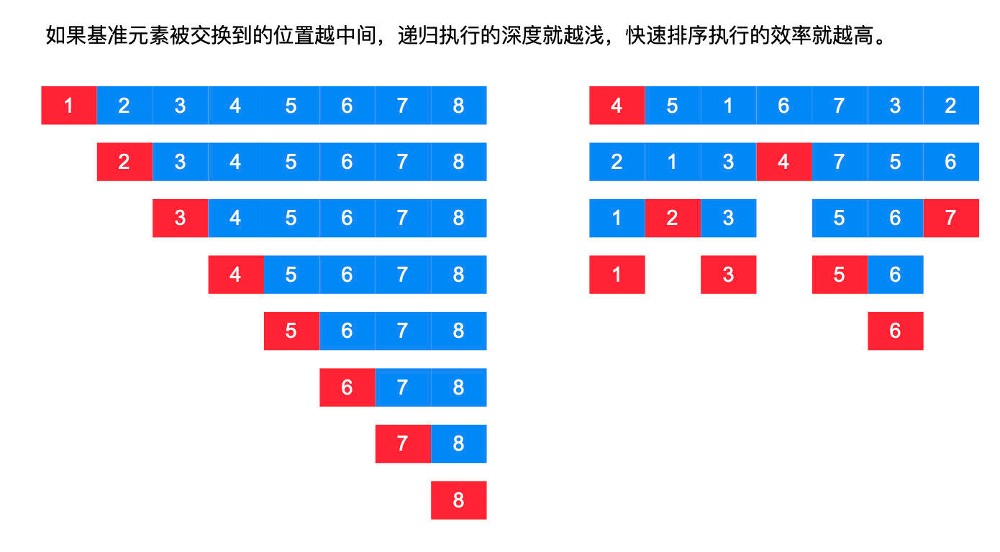
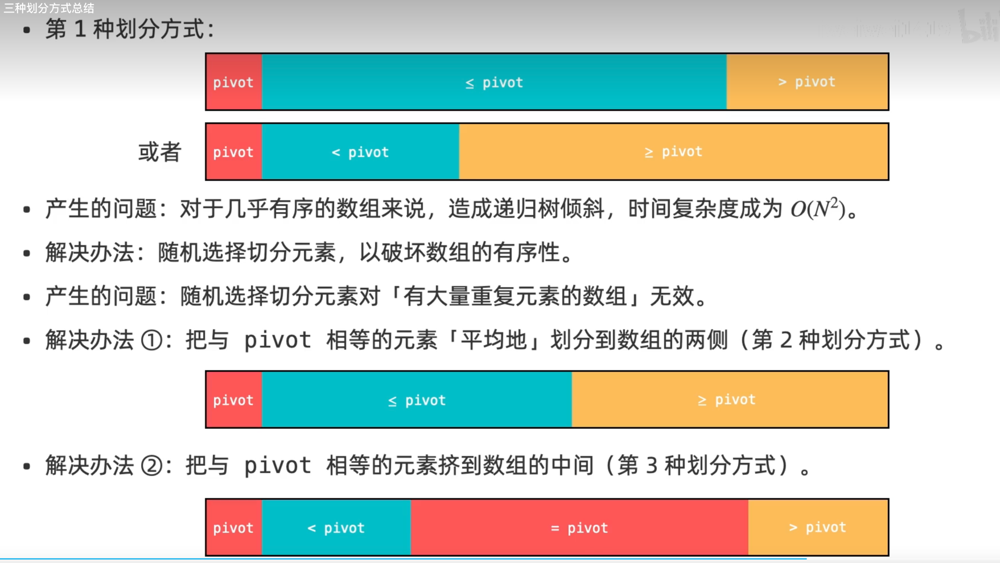
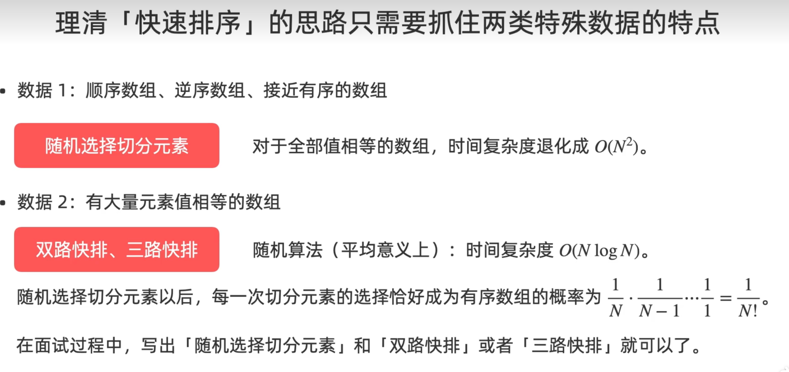

> 参考：https://suanfa8.com/quick-sort

# 快速排序和归并排序的区别
归并排序与快速排序都使用了「分治思想」

归并排序
* 拆分：不管数组的形态，总是将数组一分为二；
* 组合：合并两个有序的数组。

快速排序
* 拆分：根据某个元素 pivot，将数组整理成两个部分；
  - 前半部分小于等于 pivot， 后半部分大于等于 pivot；
  - 把 pivot 交换到前半部分的最后一个元素。
* 组合：什么都不用做。

# 快速排序partition详解
切分的思路是这样的：
* 从标定点后面一个一个地比较到底，遇到比标定元素大的，就放过，
* 遇到比标定元素小的，就依次放在标定元素的后面。
* 大放过，小交换。

说明：示意图为了表意清晰没有讨论 = 的情况。


切分过程展示：

最后交换 6 和 5，完成切分。


# 快速排序的优化方向
快速排序的实现需要注意以下2点： 

## 1.基准值的选择：
基准值的选择对快速排序的效率有很大的影响。
* 一般来说，可以选择序列的第一个元素、最后一个元素或者中间的元素作为基准值。
* 另外，还可以采用随机选择的方法来选择基准值，这样可以避免出现最坏情况。

> 1.避免这种最坏的情况出现，我们在切分 partition 之前，只需要在待排序的区间里，随机选择一个元素交换到数组的第 1 个位置就可以了，这样，最坏的情况出现的概率就极其低了。
> 
> 2.针对特殊测试用例（顺序数组、逆序数组或者接近有序的数组）一定要随机化选择切分元素（pivot），否则在输入数组是有序数组或者是逆序数组的时候，快速排序会变得非常慢（等同于冒泡排序或者「选择排序」）。

### 优化 1：随机选择标定点元素，降低递归树结构不平衡的情况
- 由于快速排序在近乎有序的时候会非常差，此时递归树的深度会增加。此时快速排序的算法就退化为(O(N^2)。
- 解决办法：我们在每一次迭代开始之前，随机选取一个元素作为基准元素与第 1 个元素交换即可。
```
randomIdx = random.choice(range(left, right + 1))
pivot = nums[randomIdx]
nums[left], nums[randomIdx] = nums[randomIdx], nums[left]
```


## 2.重复元素的处理：
针对特殊测试用例（有很多重复元素的输入数组）有 3 种版本的快排：

* 版本 1：基本快排：把等于切分元素的所有元素分到了数组的同一侧，可能会造成递归树倾斜；
* 版本 2：双指针快排：把等于切分元素的所有元素 等概率 地分到了数组的两侧，避免了递归树倾斜，递归树相对平衡；
* 版本 3：三指针快排：把等于切分元素的所有元素挤到了数组的中间，在有很多元素和切分元素相等的情况下，递归区间大大减少。


> 这里有一个经验的总结：之所以快排有这些优化，起因都是来自「递归树」的高度。
>* 关于「树」的算法的优化，绝大部分都是在和树的「高度」较劲。
>* 类似的通过减少树高度、使得树更平衡的数据结构还有「二叉搜索树」优化成「AVL 树」或者「红黑树」、「并查集」的「按秩合并」与「路径压缩」。

1. 写对「快速排序」的技巧：保持「循环不变量」，即定义的变量在循环开始前、循环过程中、循环结束以后，都保持不变的性质，这个性质是人为根据问题特点定义的。 
2. 「循环不变量」的内容在《算法导论》这本书里有介绍。我个人觉得非常有用。 「循环不变量」是证明算法有效性的基础，更是写对代码的保证，遵守循环不变量，是不是该写等于号，先交换还是先 ++ ，就会特别清楚，绝对不会写错，我在编码的时候，会将遵守的「循环不变量」作为注释写在代码中。



# 快速排序其他说明：
1. 和归并排序一样，`小区间使用插入排序`(这一点已经被广泛应用)
2. 快速排序是原地排序算法，原地排序 != 空间复杂度为O(1)
3. 快速排序不是稳定的排序算法，因此 `对象数组排序不使用快速排序`

> 参考资料：算法导论（第三版）第 7 章，第 9 章


